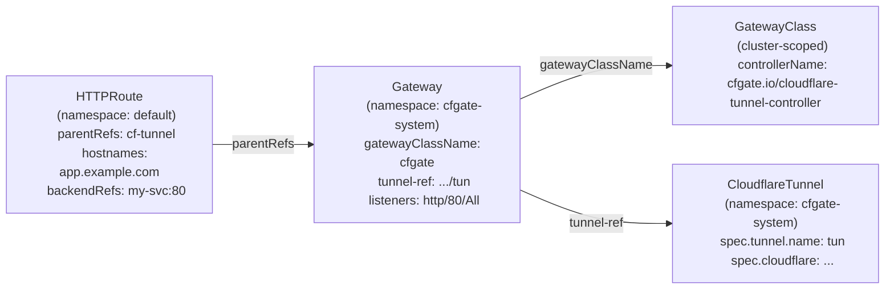

# Gateway API Primer

## Coming from Ingress?

Gateway API is the Kubernetes successor to Ingress, providing a role-oriented, portable, and expressive API for service networking. If you are migrating from an Ingress-based Cloudflare operator (such as [STRRL/cloudflare-tunnel-ingress-controller](https://github.com/STRRL/cloudflare-tunnel-ingress-controller) or [adyanth/cloudflare-operator](https://github.com/adyanth/cloudflare-operator)), this page explains the key concepts you need to understand.

Gateway API separates concerns by role: infrastructure providers define GatewayClasses, cluster operators create Gateways, and application developers attach Routes. This maps cleanly to cfgate's architecture.

## Key Concepts

### GatewayClass

A GatewayClass defines which controller handles a class of Gateways. It is a cluster-scoped resource (not namespaced).

cfgate registers the controller name `cfgate.io/cloudflare-tunnel-controller`. You create a GatewayClass that references this controller name, and cfgate will handle all Gateways bound to that class.

Think of GatewayClass as the "driver": it tells Kubernetes which software manages Gateways of this type.

```yaml
apiVersion: gateway.networking.k8s.io/v1
kind: GatewayClass
metadata:
  name: cfgate
spec:
  controllerName: cfgate.io/cloudflare-tunnel-controller
```

You only need one GatewayClass for cfgate. The controller accepts it automatically when `spec.controllerName` matches.

### Gateway

A Gateway is a runtime instance bound to a GatewayClass. In cfgate, a Gateway represents a Cloudflare Tunnel endpoint.

The `cfgate.io/tunnel-ref` annotation connects the Gateway to a CloudflareTunnel resource. The GatewayClass tells Kubernetes that cfgate manages this Gateway; the Gateway itself is the runtime binding between the tunnel and the routes.

```yaml
apiVersion: gateway.networking.k8s.io/v1
kind: Gateway
metadata:
  name: cloudflare-tunnel
  namespace: cfgate-system
  annotations:
    cfgate.io/tunnel-ref: cfgate-system/my-tunnel
spec:
  gatewayClassName: cfgate
  listeners:
    - name: http
      protocol: HTTP
      port: 80
      allowedRoutes:
        namespaces:
          from: All
```

Key points:
- `gatewayClassName: cfgate` binds this Gateway to the cfgate GatewayClass
- `cfgate.io/tunnel-ref` links to the CloudflareTunnel that provides the actual tunnel
- `allowedRoutes.namespaces.from: All` permits routes from any namespace to attach (default is `Same`, which restricts to the Gateway's namespace)
- The `port` and `protocol` fields satisfy the Gateway API spec but do not determine what cloudflared actually serves. Cloudflared routing is driven by the routes themselves

### Routes (HTTPRoute, TCPRoute, UDPRoute, GRPCRoute)

Routes attach to Gateways via `parentRefs` and define routing rules. In cfgate, each route becomes one or more cloudflared ingress rules.

**HTTPRoute** and **GRPCRoute** are fully supported. **TCPRoute** and **UDPRoute** have stub controllers planned for v0.2.0.

```yaml
apiVersion: gateway.networking.k8s.io/v1
kind: HTTPRoute
metadata:
  name: my-app
  namespace: default
spec:
  parentRefs:
    - name: cloudflare-tunnel
      namespace: cfgate-system
  hostnames:
    - app.example.com
  rules:
    - backendRefs:
        - name: my-service
          port: 80
```

This creates a cloudflared ingress rule: `app.example.com` routes to `http://my-service.default.svc.cluster.local:80`.

Per-route behavior is configured via annotations on the Route resource. See [Annotations Reference](annotations.md) for the full list.

## How cfgate Uses Gateway API

The full chain from infrastructure to application routing:



1. **GatewayClass** tells Kubernetes that cfgate handles Gateways with `controllerName: cfgate.io/cloudflare-tunnel-controller`.
2. **Gateway** creates the tunnel binding via the `cfgate.io/tunnel-ref` annotation. The controller sets the Gateway status to `Programmed` when the tunnel is ready.
3. **Routes** define which hostnames and paths map to which backend services. cfgate collects routes attached to Gateways it manages and pushes them as cloudflared ingress rules.
4. **CloudflareDNS** (optional) watches routes and creates CNAME records pointing hostnames to the tunnel domain.

## The cfgate-system Namespace

cfgate installs into `cfgate-system` by default:
- **Helm:** `--namespace cfgate-system --create-namespace` creates it automatically
- **Kustomize:** The `install.yaml` manifest includes the namespace definition

CloudflareTunnel and CloudflareDNS resources typically live in `cfgate-system` alongside the controller. Routes and the services they reference can be in any namespace.

To allow routes from other namespaces to attach to a Gateway in `cfgate-system`, set `allowedRoutes.namespaces.from: All` on the Gateway listener:

```yaml
spec:
  listeners:
    - name: http
      protocol: HTTP
      port: 80
      allowedRoutes:
        namespaces:
          from: All      # Routes from any namespace can attach
```

Without this, only routes in the same namespace as the Gateway can attach. You can also use `Selector` with label selectors for finer control.

## Comparison with Ingress

| Concept | Ingress | Gateway API (cfgate) |
|---|---|---|
| Controller selection | IngressClass | GatewayClass |
| Runtime instance | Implicit (Ingress resources create it) | Explicit Gateway resource |
| Routing rules | Ingress resource (host + path rules) | HTTPRoute, TCPRoute, GRPCRoute, UDPRoute |
| Per-route config | Annotations on Ingress | Annotations on Route |
| Multi-tenancy | Namespace isolation only | Gateway `allowedRoutes` with namespace selectors |
| Protocol support | HTTP/HTTPS only | HTTP, gRPC, TCP, UDP (extensible) |
| Role separation | None (one resource does everything) | GatewayClass (infra), Gateway (ops), Route (dev) |
| Cross-namespace routing | Not supported | Built-in via `parentRefs` with namespace |

### Migration Notes

If you are migrating from an Ingress-based Cloudflare operator:

1. **Create a GatewayClass and Gateway.** These replace the implicit infrastructure that Ingress-based operators manage behind the scenes.
2. **Convert Ingress resources to HTTPRoutes.** Each Ingress host/path rule becomes an HTTPRoute. The `parentRefs` field replaces the IngressClass binding.
3. **Move annotations.** Ingress annotations on the Ingress resource move to per-route annotations on HTTPRoute resources. Annotation names may differ; see [Annotations Reference](annotations.md).
4. **Set up CloudflareDNS.** Ingress operators often handle DNS automatically. With cfgate, DNS management is a separate CRD (CloudflareDNS) that you configure explicitly.

## Further Reading

- [Gateway API documentation](https://gateway-api.sigs.k8s.io/)
- [cfgate Annotations Reference](annotations.md)
- [cfgate Troubleshooting](troubleshooting.md)
