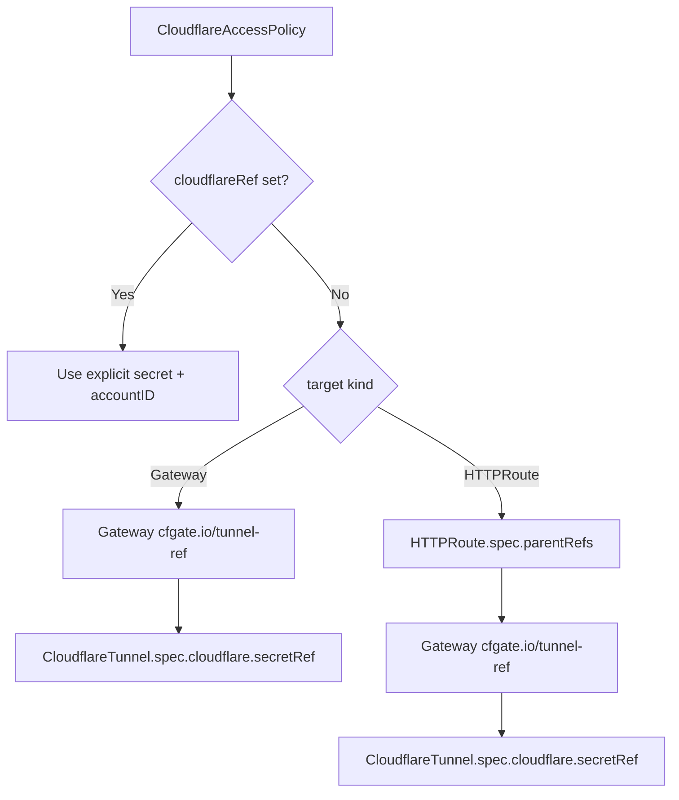

# Troubleshooting

## DNS Records Not Syncing

### Symptoms
- CNAME records are not created in Cloudflare for your hostnames
- `kubectl get cloudflaredns` shows `READY: False` or `SYNCED: 0`
- Applications are unreachable because DNS does not resolve to the tunnel

### Diagnostic Steps

1. Check CloudflareDNS status:
   ```bash
   kubectl get cloudflaredns -A
   ```
   Expected output when healthy:
   ```
   NAMESPACE       NAME     READY   SYNCED   PENDING   FAILED   AGE
   cfgate-system   my-dns   True    3        0         0        5m
   ```

2. Check conditions for details:
   ```bash
   kubectl get cloudflaredns my-dns -n cfgate-system -o jsonpath='{.status.conditions}' | jq .
   ```
   Look for:
   - `Ready`: overall health
   - `CredentialsValid`: API token works
   - `ZonesResolved`: zone names resolved to zone IDs
   - `RecordsSynced`: DNS records pushed to Cloudflare
   - `OwnershipVerified`: TXT ownership records confirmed

3. If using `annotationFilter`, verify HTTPRoutes have the matching annotation.

   The `annotationFilter` field on `spec.source.gatewayRoutes` accepts a user-defined annotation as a filter. It is NOT a fixed cfgate annotation. If your CloudflareDNS has:
   ```yaml
   spec:
     source:
       gatewayRoutes:
         enabled: true
         annotationFilter: "cfgate.io/dns-sync=enabled"
   ```
   Then every HTTPRoute you want synced must have:
   ```yaml
   metadata:
     annotations:
       cfgate.io/dns-sync: "enabled"
   ```
   Routes without this annotation are silently skipped.

4. Check that the tunnel is Ready (DNS needs the tunnel domain for the CNAME target):
   ```bash
   kubectl get cloudflaretunnel -A
   ```
   Expected output:
   ```
   NAMESPACE       NAME        READY   TUNNEL ID                              ROUTES   AGE
   cfgate-system   my-tunnel   True    abcdef12-3456-7890-abcd-ef1234567890   3        10m
   ```
   If `READY` is `False`, resolve the tunnel issue first. CloudflareDNS cannot create CNAMEs without a tunnel domain.

5. Check controller logs:
   ```bash
   kubectl logs -n cfgate-system deploy/cfgate -c manager | grep cloudflaredns
   ```

### Common Causes

| Cause | Solution |
|---|---|
| Tunnel not ready | Fix the CloudflareTunnel first. DNS needs `status.tunnelDomain` for the CNAME target. |
| Zone not configured | Add the zone to `spec.zones[]`. The zone name must match the domain suffix of your hostnames. |
| API token missing DNS:Edit permission | Add Zone-level `DNS: Edit` permission to your Cloudflare API token. |
| annotationFilter mismatch | Verify the annotation key and value on your HTTPRoutes matches the filter exactly. |
| No routes found | Ensure `spec.source.gatewayRoutes.enabled: true` and routes have `parentRefs` pointing to a Gateway with `cfgate.io/tunnel-ref`. |
| Gateway missing tunnel-ref | Add `cfgate.io/tunnel-ref: namespace/name` annotation to the Gateway resource. |

---

## GatewayClass Not Accepted

### Symptoms
- `kubectl get gatewayclass cfgate` shows no `Accepted` condition or `Accepted: False`
- Gateway resources stay in `NotAccepted` state

### Diagnostic Steps

1. Verify the controller name is exact:
   ```bash
   kubectl get gatewayclass cfgate -o jsonpath='{.spec.controllerName}'
   ```
   Expected output:
   ```
   cfgate.io/cloudflare-tunnel-controller
   ```
   The controller name must be exactly `cfgate.io/cloudflare-tunnel-controller`. Any typo (extra spaces, wrong prefix) causes the GatewayClass to remain unaccepted.

2. Check the controller is running:
   ```bash
   kubectl get pods -n cfgate-system
   ```
   Expected output:
   ```
   NAME                     READY   STATUS    RESTARTS   AGE
   cfgate-6b8f9d4c5-x7k2p  1/1     Running   0          5m
   ```

3. Check controller logs for startup errors:
   ```bash
   kubectl logs -n cfgate-system deploy/cfgate -c manager | grep gatewayclass
   ```

4. Verify Gateway API CRDs are installed:
   ```bash
   kubectl get crd gatewayclasses.gateway.networking.k8s.io
   ```
   If this returns `NotFound`, install the Gateway API CRDs:
   ```bash
   kubectl apply -f https://github.com/kubernetes-sigs/gateway-api/releases/download/v1.4.1/standard-install.yaml
   ```

### Common Causes

| Cause | Solution |
|---|---|
| Typo in `spec.controllerName` | Must be exactly `cfgate.io/cloudflare-tunnel-controller` |
| Controller not running | Check pod status, describe pod for crash reasons |
| Gateway API CRDs not installed | Install Gateway API CRDs before cfgate |
| Multiple GatewayClasses with same controllerName | cfgate accepts all matching GatewayClasses, but check for conflicts |

---

## Access Policy CredentialsInvalid

### Symptoms
- CloudflareAccessPolicy shows condition `CredentialsValid: False` with reason `CredentialsInvalid`
- Status message: "set cloudflareRef or ensure targets reference a tunnel"

### Diagnostic Steps

1. Determine which credential path you are using.

   **Explicit credentials** (set directly on the policy):
   ```bash
   kubectl get cloudflareaccesspolicy my-policy -n cfgate-system -o jsonpath='{.spec.cloudflareRef}'
   ```
   If this returns a value, verify the referenced secret exists and contains `CLOUDFLARE_API_TOKEN`:
   ```bash
   kubectl get secret <secret-name> -n <namespace> -o jsonpath='{.data.CLOUDFLARE_API_TOKEN}' | base64 -d | head -c 5
   ```

   **Inherited credentials** (resolved via target chain):

   The controller walks a chain to find credentials. Verify each step:

   a. For **Gateway** targets: Gateway must have `cfgate.io/tunnel-ref` annotation pointing to a CloudflareTunnel:
   ```bash
   kubectl get gateway <gw-name> -n <ns> -o jsonpath='{.metadata.annotations.cfgate\.io/tunnel-ref}'
   ```

   b. For **HTTPRoute** targets: The controller walks HTTPRoute -> parentRef -> Gateway -> tunnel-ref -> CloudflareTunnel:
   ```bash
   # Check the HTTPRoute's parent Gateway
   kubectl get httproute <route-name> -n <ns> -o jsonpath='{.spec.parentRefs}'
   # Then check that Gateway's tunnel-ref annotation
   kubectl get gateway <parent-gw> -n <parent-ns> -o jsonpath='{.metadata.annotations.cfgate\.io/tunnel-ref}'
   ```

   c. Verify the CloudflareTunnel's secret exists:
   ```bash
   kubectl get cloudflaretunnel <tunnel-name> -n <ns> -o jsonpath='{.spec.cloudflare.secretRef.name}'
   ```

2. Verify the API token has required permissions:
   - `Access: Apps and Policies: Edit` (Account level)
   - `Access: Service Tokens: Edit` (Account level, if using service tokens)

3. Check controller logs:
   ```bash
   kubectl logs -n cfgate-system deploy/cfgate -c manager | grep accesspolicy
   ```

### Credential Resolution Chain



### Common Causes

| Cause | Solution |
|---|---|
| No `cloudflareRef` and target Gateway has no `tunnel-ref` | Add `cfgate.io/tunnel-ref` to the Gateway, or set `cloudflareRef` explicitly |
| Secret deleted or missing | Re-create the credentials secret |
| Wrong secret key | Default key is `CLOUDFLARE_API_TOKEN`. Check secret data keys match. |
| Token lacks Access permissions | Add `Access: Apps and Policies: Edit` at Account level |
| Cross-namespace target without ReferenceGrant | Create a ReferenceGrant in the target namespace |

---

## Gateway Not Programmed

### Symptoms
- Gateway shows condition `Programmed: False`
- HTTPRoutes attached to the Gateway show `Accepted: False` in status

### Diagnostic Steps

1. Check the tunnel referenced by the Gateway:
   ```bash
   # Get the tunnel reference
   kubectl get gateway <gw-name> -n <ns> -o jsonpath='{.metadata.annotations.cfgate\.io/tunnel-ref}'

   # Check tunnel status
   kubectl get cloudflaretunnel -A
   ```
   Expected output:
   ```
   NAMESPACE       NAME        READY   TUNNEL ID                              ROUTES   AGE
   cfgate-system   my-tunnel   True    abcdef12-3456-7890-abcd-ef1234567890   3        10m
   ```

2. If the tunnel is not Ready, check its conditions:
   ```bash
   kubectl get cloudflaretunnel my-tunnel -n cfgate-system -o jsonpath='{.status.conditions}' | jq .
   ```
   The tunnel has 5 conditions that must all be True for full health:
   - `CredentialsValid`: API token works
   - `TunnelReady`: Tunnel exists in Cloudflare
   - `CloudflaredDeployed`: cloudflared deployment is running
   - `ConfigurationSynced`: Ingress config pushed to Cloudflare
   - `Ready`: Overall health (all above are True)

3. Check the cloudflared deployment:
   ```bash
   kubectl get deploy -n cfgate-system -l app.kubernetes.io/managed-by=cfgate
   ```

4. Check controller logs:
   ```bash
   kubectl logs -n cfgate-system deploy/cfgate -c manager | grep gateway
   ```

### Common Causes

| Cause | Solution |
|---|---|
| Missing `cfgate.io/tunnel-ref` annotation | Add annotation pointing to `namespace/name` of CloudflareTunnel |
| Tunnel not ready | Fix tunnel issues first (credentials, API access) |
| GatewayClass not accepted | Verify `spec.gatewayClassName` references an accepted GatewayClass |
| cloudflared pods crashing | Check pod logs: `kubectl logs -n cfgate-system deploy/cloudflared-<tunnel-name> -c cloudflared` |

---

## Stuck Finalizers

### Symptoms
- A CloudflareTunnel, CloudflareDNS, or CloudflareAccessPolicy is stuck in `Terminating` state
- `kubectl delete` hangs or the resource does not disappear

### Background

cfgate adds finalizers to CRDs so that Cloudflare-side resources (tunnels, DNS records, Access applications) are cleaned up before the Kubernetes resource is removed. The finalizer blocks deletion until cleanup completes, which requires working Cloudflare API credentials.

### Diagnostic Steps

1. Check what finalizers are present:
   ```bash
   kubectl get <resource-type> <name> -n <namespace> -o jsonpath='{.metadata.finalizers}'
   ```
   cfgate finalizers:
   - `cfgate.io/tunnel-cleanup` (CloudflareTunnel)
   - `cfgate.io/dns-cleanup` (CloudflareDNS)
   - `cfgate.io/access-policy-cleanup` (CloudflareAccessPolicy)

2. Check if credentials are still valid. If the secret was deleted before the resource, the finalizer cannot complete cleanup.

3. Check controller logs for cleanup errors:
   ```bash
   kubectl logs -n cfgate-system deploy/cfgate -c manager | grep "deletion\|cleanup\|finalizer"
   ```

4. For CloudflareTunnel: the controller retries Cloudflare deletion for up to 2 minutes before giving up and removing the finalizer anyway. If the tunnel has active cloudflared connections, it waits for them to drain (~30s). If you are stuck beyond 2 minutes, something else is wrong (controller not running, RBAC issues).

### Resolution Options

**Option 1: Use the `cfgate.io/deletion-policy` annotation (preferred)**

This tells the controller to skip Cloudflare cleanup and remove the finalizer immediately:

```bash
kubectl annotate cloudflaretunnel my-tunnel cfgate.io/deletion-policy=orphan
kubectl annotate cloudflareaccesspolicy my-policy cfgate.io/deletion-policy=orphan
```

The resource should terminate within seconds. The Cloudflare-side resource remains and must be cleaned up manually.

**Option 2: Force-remove the finalizer**

If the controller is not running or cannot process the annotation:

```bash
kubectl patch cloudflaretunnel my-tunnel -n cfgate-system \
  -p '{"metadata":{"finalizers":null}}' --type=merge
```

Replace `cloudflaretunnel` with `cloudflaredns` or `cloudflareaccesspolicy` as needed.

**Warning:** Both options leave orphaned resources in Cloudflare (tunnels, DNS records, Access applications) that must be manually deleted in the Cloudflare dashboard.

---

## Uninstalling cfgate / CRD Deletion

### Safe Removal Process

1. **Delete custom resources first** (finalizers need the controller running with API access to clean up Cloudflare-side resources):
   ```bash
   kubectl delete cloudflareaccesspolicies --all -A
   kubectl delete cloudflaredns --all -A
   kubectl delete cloudflaretunnels --all -A
   ```
   Wait for all resources to terminate. Each deletion triggers finalizer cleanup that calls the Cloudflare API to remove tunnels, DNS records, and Access applications.

2. **Uninstall cfgate:**
   ```bash
   # Helm
   helm uninstall cfgate -n cfgate-system

   # Kustomize
   kubectl delete -f https://github.com/inherent-design/cfgate/releases/latest/download/install.yaml
   ```

3. **Delete CRDs** (optional; only if you want full removal):
   ```bash
   kubectl delete crd cloudflaretunnels.cfgate.io cloudflaredns.cfgate.io cloudflareaccesspolicies.cfgate.io
   ```

### Why Helm Does Not Delete CRDs by Default

CRD deletion in Kubernetes cascades: deleting the CRD deletes ALL custom resources of that type across all namespaces. For cfgate, this would simultaneously delete all tunnels, DNS records, and Access policies. These resources have finalizers that need Cloudflare API access for cleanup. If CRDs are deleted before resources, finalizers cannot run, leaving orphaned Cloudflare resources with no automated cleanup path. This is a Helm-wide convention for safety.

### Emergency: Stuck in Terminating

If resources are stuck terminating (credentials gone, controller not running, cannot complete finalizer):

```bash
# Option 1: Use deletion-policy annotation (requires controller running)
kubectl annotate cloudflaretunnel my-tunnel cfgate.io/deletion-policy=orphan

# Option 2: Force-remove finalizer (works even without controller)
kubectl patch cloudflaretunnel my-tunnel -n cfgate-system \
  -p '{"metadata":{"finalizers":null}}' --type=merge
```

**Warning:** Both options leave orphaned resources in Cloudflare that must be manually deleted in the Cloudflare dashboard.

---

## Checking Controller Logs

### Log Commands

```bash
# All controller logs
kubectl logs -n cfgate-system deploy/cfgate -c manager

# Follow logs in real time
kubectl logs -n cfgate-system deploy/cfgate -c manager -f

# Filter by controller/reconciler
kubectl logs -n cfgate-system deploy/cfgate -c manager | grep tunnel
kubectl logs -n cfgate-system deploy/cfgate -c manager | grep dns
kubectl logs -n cfgate-system deploy/cfgate -c manager | grep accesspolicy
kubectl logs -n cfgate-system deploy/cfgate -c manager | grep gateway
kubectl logs -n cfgate-system deploy/cfgate -c manager | grep gatewayclass
kubectl logs -n cfgate-system deploy/cfgate -c manager | grep httproute
```

### Common Log Patterns

| Pattern | Meaning |
|---|---|
| `"starting reconciliation"` | Normal: controller processing a resource |
| `"credentials validation failed"` | API token invalid or secret missing |
| `"tunnel not found on Cloudflare, clearing tunnelID"` | Tunnel was deleted on CF side; controller will re-create |
| `"retry budget exhausted"` | Tunnel deletion failed after 2 minutes of retries |
| `"orphaning tunnel due to deletion policy"` | `cfgate.io/deletion-policy: orphan` was set |
| `"no hostnames discovered with gatewayRoutes enabled"` | DNS controller found no routes; will retry in 10s |
| `"failed to resolve credentials for deletion"` | Credentials unavailable during cleanup; finalizer removed anyway |

### Common Deployment Names

| Install Method | Deployment Name | Container Name |
|---|---|---|
| Helm (`helm install cfgate ...`) | `deploy/cfgate` | `manager` |
| Kustomize | `deploy/controller-manager` | `manager` |

Adjust the `deploy/cfgate` in log commands above if using kustomize:

```bash
kubectl logs -n cfgate-system deploy/controller-manager -c manager
```
